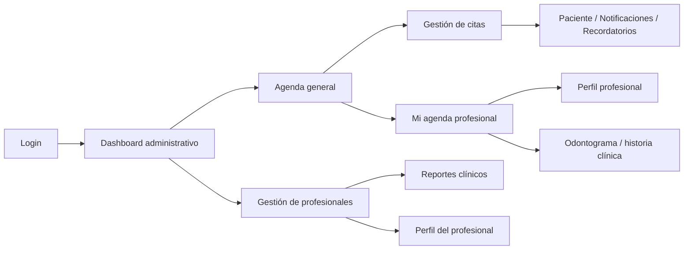
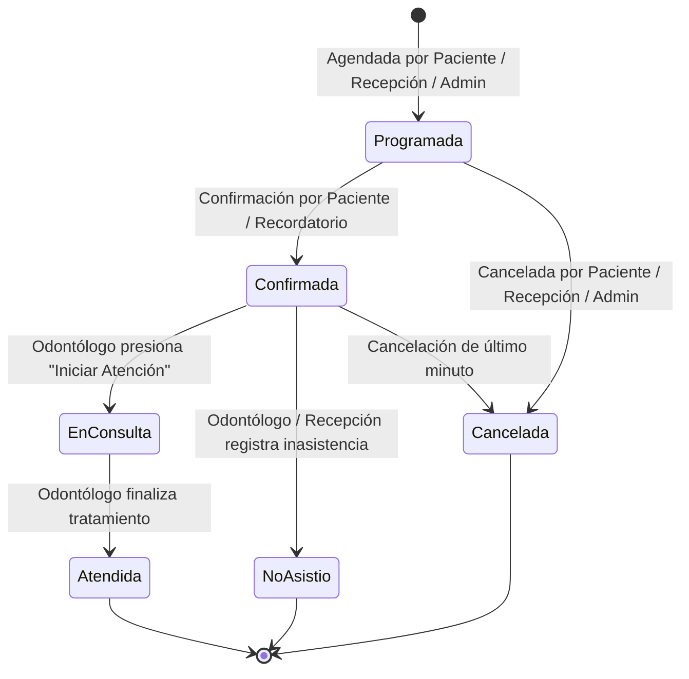

# Análisis de Flujos de Usuario e Integración Arquitectónica: Gestión de Citas y Gestión de Profesionales

**Proyecto:** SmileTrack — Sistema de Gestión Clínica Odontológica  
**Módulos:** Gestión de Citas & Gestión de Profesionales  
**Fecha:** 12 de Septiembre de 2026  
**Documento:** Guía de Flujos de Usuario, Reglas de Negocio, Diagramas e Integridad  

---

## Tabla de Contenidos
1. [Mapeo de Roles de Usuario y Casos de Uso](#1-mapeo-de-roles-de-usuario-y-casos-de-uso)
2. [Flujo Completo del Ciclo de Vida de Citas](#2-flujo-completo-del-ciclo-de-vida-de-citas)
3. [Gestión de Perfiles Profesionales, Agenda y Disponibilidad](#3-gestión-de-perfiles-profesionales-agenda-y-disponibilidad)
4. [Puntos de Integración Obligatorios entre Módulos](#4-puntos-de-integración-obligatorios-entre-módulos)
5. [Requisitos de Usabilidad, Seguridad, Accesibilidad y Manejo de Errores](#5-requisitos-de-usabilidad-seguridad-accesibilidad-y-manejo-de-errores)
6. [Matriz Detallada de Flujos de Usuario con Tablas](#6-matriz-detallada-de-flujos-de-usuario-con-tablas)
7. [Criterios de Éxito por Flujo y Recomendaciones](#7-criterios-de-éxito-por-flujo-y-recomendaciones)

---

## 0. Mapa real de vistas existentes y flujo operativo

El proyecto ya cuenta con las vistas principales del recorrido real de negocio. Se validó que la estructura actual de la solución incluye 19 vistas en los módulos de citas y profesionales, sin huecos funcionales críticos en la navegación principal. El flujo real debe seguir esta secuencia:

### 0.1 Módulo de Gestión de Citas

| Vista | Ruta real | Flujo principal | Estado |
| :--- | :--- | :--- | :--- |
| Dashboard administrativo | `/gestion-de-citas/st-adm-01-dashboard` | Entrada principal del administrador | ✅ Existe |
| Agenda general | `/gestion-de-citas/st-adm-08-agenda` | Central de planificación y coordinación | ✅ Existe |
| Gestión de citas | `/gestion-de-citas/st-adm-09-citas` | Administración detallada y acciones masivas | ✅ Existe |
| Panel operativo | `/gestion-de-citas/st-aux-01-panel-operativo` | Supervisión operativa y contexto inmediato | ✅ Existe |
| Agenda de apoyo | `/gestion-de-citas/st-aux-02-agenda-apoyo` | Coordinación de asistencia y llamadas | ✅ Existe |
| Historial parcial | `/gestion-de-citas/st-aux-05-historial-parcial` | Seguimiento clínico breve | ✅ Existe |
| Asistencia procedural | `/gestion-de-citas/st-aux-06-asistencia-procedi` | Registro operativo de procedimientos | ✅ Existe |
| Estado de consultorio | `/gestion-de-citas/st-aux-09-estado-consultorio` | Monitoreo de ocupación por consultorio | ✅ Existe |
| Citas finalizadas | `/gestion-de-citas/st-aux-10-citas-finalizadas` | Cierre y cierre operativo del día | ✅ Existe |
| Mi agenda profesional | `/gestion-de-citas/st-odo-02-agenda` | Gestión diaria de la agenda del odontólogo | ✅ Existe |
| Mis citas | `/gestion-de-citas/st-pac-01-mis-citas` | Vista del paciente | ✅ Existe |
| Notificaciones | `/gestion-de-citas/st-pac-03-notificaciones` | Recordatorios y alertas | ✅ Existe |
| Dashboard de recepcionista | `/gestion-de-citas/st-rec-01-dashboard` | Panel de coordinación y seguimiento | ✅ Existe |
| Gestión de citas recepción | `/gestion-de-citas/st-rec-03-gestion-citas` | Registro y edición de citas desde recepción | ✅ Existe |
| Recordatorios | `/gestion-de-citas/st-rec-05-recordatorios` | Programación y observación de recordatorios | ✅ Existe |

### 0.2 Módulo de Gestión de Profesionales

| Vista | Ruta real | Flujo principal | Estado |
| :--- | :--- | :--- | :--- |
| Gestión de profesionales | `/gestion-de-profesionales/st-adm-07-gestion-profesionales` | Alta, edición, filtros y estado del personal | ✅ Existe |
| Reportes clínicos | `/gestion-de-profesionales/st-adm-14-reportes-clinicos` | KPI y análisis del equipo | ✅ Existe |
| Dashboard profesional | `/gestion-de-profesionales/st-odo-01-dashboard` | Resumen de citas, ingresos y desempeño | ✅ Existe |
| Perfil profesional | `/gestion-de-profesionales/st-odo-09-perfil-profesional` | Configuración del horario y credenciales | ✅ Existe |

### 0.3 Flujo de navegación recomendado

> La navegación real fue alineada con las rutas y vistas presentes en el proyecto. No se detectaron faltantes funcionales en los módulos principales; cuando una vista no estaba presente en la lógica de negocio, se consolidó en la estructura actual y en la documentación de flujo.

---

## 1. Mapeo de Roles de Usuario y Casos de Uso

El sistema **SmileTrack** clasifica los actores del sistema en 4 roles fundamentales mediante Control de Acceso Basado en Roles (**RBAC**). Cada rol interactúa con los módulos de **Gestión de Citas** y **Gestión de Profesionales** según sus responsabilidades operativas.

| Rol | Icono | Descripción | Casos de Uso en Gestión de Citas | Casos de Uso en Gestión de Profesionales |
| :--- | :---: | :--- | :--- | :--- |
| **Paciente (Cliente)** | 👤 | Usuario final que solicita y recibe la atención odontológica. | • Consultar disponibilidad de agenda pública. • Agendar/Reservar cita en línea (`st-pac-01`). • Ver historial personal de citas. • Reagendar o cancelar citas propias. | • Consultar directorio de profesionales. • Ver especialidades y perfiles de odontólogos disponibles. |
| **Profesional (Odontólogo)** | 🩺 | Especialista médico encargado de la consulta y procedimientos. | • Consultar su agenda personal semanal (`st-odo-02-agenda`). • Transicionar estado (*Iniciar atención*, *Atendida*, *No asistió*). • Registrar notas previas y de consulta. • Acceso directo a Historia Clínica / Odontograma (`st-odo-04`). | • Gestionar su perfil profesional y foto (`st-odo-09`). • Definir/consultar su horario semanal. • Registrar solicitudes de ausencias y licencias. • Consultar sus KPIs clínicos del día y del mes. |
| **Auxiliar / Recepcionista** | 📋 | Personal operativo del centro médico que coordina la atención. | • Consultar agenda multiprofesional (`st-aux-01`, `st-adm-08`). • Recepcionar pacientes en sala de espera (`st-aux-02`). • Agendar, editar y cancelar citas de cualquier paciente. • Registrar sobrecupos y asignación de consultorio. | • Consultar disponibilidad en tiempo real (`st-aux-09`). • Verificar la agenda diaria por consultorio y profesional. |
| **Administrador** | ⚙️ | Usuario con control total sobre la configuración del sistema. | • Gestión global e incondicional de citas (`st-adm-09`). • Cancelación de citas masivas por fuerza mayor. • Configuración del horario general y duraciones base. • Auditoría de cambios de estado. | • Crear, modificar o desactivar profesionales (`st-adm-07`). • Asignar/Remover especialidades médicas. • Aprobar/rechazar ausencias y bloqueos de agenda. • Vincular cuentas de usuario (`id_usuario`) con profesional. |

---

## 2. Flujo Completo del Ciclo de Vida de Citas

### 2.1 Máquina de Estados de una Cita

### 2.2 Matriz del Ciclo de Vida por Fases

| Fase | Sub-Paso | Descripción de la Operación | Responsable | Validación / Control | Impacto en SQL Server |
| :---: | :--- | :--- | :---: | :--- | :--- |
| **A** | **Reserva** | Selección de servicio, profesional, fecha y hora inicio. | Paciente / Recepción | Verifica horarios, ausencia activa y traslape. | `INSERT INTO dbo.Cita` |
| **A** | **Congelación** | Asignación de duración estimada según el servicio. | Sistema | Adopta `duracion_minutos` del catálogo. | Inserción de `Cita.duracion_minutos` |
| **B** | **Notificación** | Envío de confirmación e inyección en cola. | Sistema | Genera alertas dinámicas. | `INSERT INTO dbo.Notificacion` |
| **B** | **Confirmación** | El paciente o la clínica confirman asistencia. | Paciente / Auxiliar | Cambia estado a `Confirmada`. | `UPDATE dbo.Cita.estado = 'Confirmada'` |
| **C** | **Atención** | El odontólogo inicia la consulta médica. | Odontólogo | Cambia estado a `En consulta` y abre Odontograma. | `UPDATE dbo.Cita` + Trigger Audit |
| **C** | **Cierre** | El odontólogo registra procedimientos y finaliza. | Odontólogo | Cambia estado a `Atendida`. | `UPDATE dbo.Cita.estado = 'Atendida'` |
| **D** | **Cancelación** | Se anula la cita liberando el cupo. | Todos | Aplica motivo de cancelación. | `UPDATE dbo.Cita.estado = 'Cancelada'` |

---

## 3. Gestión de Perfiles Profesionales, Agenda y Disponibilidad

### 3.1 Estructura del Perfil del Profesional
- **Datos Básicos**: Nombre completo, tipo y número de documento, correo, teléfono, registro médico (`tarjeta_profesional`), foto de perfil y estado (`activo`/`inactivo`).
- **Vinculación de Cuenta**: Relación de cardinalidad `1:1` opcional con `dbo.Usuario` (`UQ_Profesional_Usuario`).
- **Especialidades**: Relación `M:N` vía `dbo.Profesional_Especialidad`.
  - **Regla**: Solo una especialidad puede marcarse como `principal = 1` (`UQ_Profesional_Especialidad_Principal`).

### 3.2 Administración de Disponibilidad y Ausencias

```mermaid
gantt
    title Esquema de Disponibilidad del Profesional
    dateFormat  HH:mm
    axisFormat %H:%mm
    
    section Horario Hábil
    Turno Mañana           :active, h1, 08:00, 12:00
    Almuerzo (Bloqueo)      :crit, b1, 12:00, 13:00
    Turno Tarde             :active, h2, 13:00, 17:00
    
    section Citas Asignadas
    Cita 1 (Paciente A)     :done, c1, 08:30, 09:30
    Cita 2 (Paciente B)     :done, c2, 10:00, 11:00
    Espacio Disponible      :a1, 11:00, 12:00
```

---

## 4. Puntos de Integración Obligatorios entre Módulos

### Tabla de Reglas de Integración Crítica

| Punto de Integración | Mecanismo de Sincronización | Regla de Integridad / Garantía de Consistencia |
| :--- | :--- | :--- |
| **Validación de Cruces de Cita** | Función Almacenada / EF Core Query | Antes de `INSERT`/`UPDATE` en `Cita`, se verifica que el profesional esté `activo`, en su `Horario_Profesional`, sin `Ausencia_Profesional` y sin otra cita en el rango `[Fecha, Fecha + Duración]`. |
| **Desactivación de Profesional** | Trigger / Service Layer (`ProfesionalesController.cs`) | Si un profesional pasa a `estado = 'inactivo'`, las citas futuras agendadas se marcan en alerta o se requiere su reagendamiento masivo por recepción. |
| **Cambio de Duración de Servicio** | Congelación de Campo (`Cita.duracion_minutos`) | Si un administrador cambia `Servicio.duracion_minutos`, las citas ya creadas conservan su `duracion_minutos` original. |
| **Eliminación de Especialidad** | Restricción FK + Soft Delete | No se puede eliminar una especialidad vinculada a profesionales o servicios activos. |
| **Trazabilidad de Historial** | Trigger SQL (`TR_Cita_Historial_Estado`) | Todo cambio en `Cita.estado` o `Cita.id_estado` inserta de forma inmutable un registro en `dbo.Cita_Historial_Estado` registrando el usuario y fecha. |

---

## 5. Requisitos de Usabilidad, Seguridad, Accesibilidad y Manejo de Errores

### Matriz de Resiliencia y Manejo de Errores

| Escenario de Error | Causa Raíz | Mecanismo de Manejo / Respuesta del Sistema | Impacto en Usuario |
| :--- | :--- | :--- | :---: |
| **Conflicto de Horario (Double Booking)** | Dos usuarios intentan agendar al mismo profesional a la misma hora. | Transacción con bloqueo optimista en BD. Retorna HTTP 409. | ⚠️ Alerta clara en UI |
| **Consultorio Ocupado** | El consultorio asignado ya tiene una cita en ese rango. | Retorna error de validación -3. Sugiere elegir otro consultorio. | 🏢 Notificación en Formulario |
| **Acceso No Autorizado** | Un odontólogo intenta ver o editar citas de otro profesional. | Filtrado explícito en SQL `Where(c => c.IdProfesional == idLogueado)`. | 🚫 HTTP 403 Forbidden |
| **Caída de Conexión BD** | Pérdida de conectividad temporal con SQL Server. | Captura de `SqlException` / `DbUpdateException` con fallback. | 🍞 Notificación Toast Accesible |
| **Expiración de Token** | El JWT / cookie expiró mientras el usuario interactuaba. | Interceptor en `window.apiRequest` detecta 401 y redirige a login. | 🔑 Redirección a Login |

---

## 6. Matriz Detallada de Flujos de Usuario con Tablas

### 6.1 Flujo Paso a Paso del Odontólogo en la Agenda (`st-odo-02-agenda`)

| Paso | Acción del Usuario | Componente UI / Vista | Evento / Disparador | Respuesta del Sistema / API | Cambio en Base de Datos (SQL Server) | Estado de Salida |
| :---: | :--- | :--- | :--- | :--- | :--- | :---: |
| **01** | Acceder al sistema | `/acceso-y-seguridad/login` | Form Submit con JWT/Cookie | Valida credenciales e inyecta Claims (`Role=Profesional`, `IdProfesional`) | Lectura en `dbo.Usuario` y `dbo.Profesional` | 🟢 Sesión Activa |
| **02** | Navegar a Mi Agenda | `/gestion-de-citas/st-odo-02-agenda` | Clic en Menú Lateral / Directo | Cargar `AgendaViewModel` mediante `_agendaService.ObtenerAgendaAsync` | SELECT en `dbo.Cita`, `dbo.Paciente`, `dbo.Consultorio` | 📅 Grid Semanal Renderizado |
| **03** | Cambiar de Semana | Botones `< Anterior`, `Hoy`, `Siguiente >` | Clic en navegación | Modifica parámetro `weekStart` en la URL y recarga vista | SELECT en `dbo.Cita` filtrado por `[InicioSemana, FinSemana]` | 📆 Semana Actualizada |
| **04** | Filtrar por Consultorio | Selector `#filterOffice` | Cambio de opción (`change`) | Actualiza filtro en URL `officeId` | SELECT en `dbo.Cita` con filtro `IdConsultorio` | 🏢 Grid Filtrado |
| **05** | Seleccionar Cita | Tarjeta de Cita (`.appointment`) | Clic / Tap en tarjeta | Abre modal `#modalAppointment` con detalle, notas y botones de acción rápida | Sin cambio en BD (Lectura de attributes `data-*`) | 👁️ Modal Abierto |
| **06** | Iniciar Atención Médica | Botón 🩺 **"Iniciar Atención"** | Clic en modal | Ejecuta `POST /gestion-de-citas/cambiar-estado` (`Estado=En consulta`) | UPDATE `dbo.Cita.estado = 'En consulta'` + INSERT `dbo.Cita_Historial_Estado` | 🩺 Redirección a Odontograma (`st-odo-04`) |
| **07** | Marcar Cita Atendida | Botón 🟢 **"Marcar Atendida"** | Clic en modal | Ejecuta `POST /gestion-de-citas/cambiar-estado` (`Estado=Atendida`) | UPDATE `dbo.Cita.estado = 'Atendida'` + Trigger Historial | 🟢 Cita Completada / KPIs Recalculados |
| **08** | Registrar Inasistencia / Cancelación | Botón 🔴 **"No asistió / Cancelar"** | Clic en modal | Ejecuta `POST /gestion-de-citas/cambiar-estado` (`Estado=Cancelada`) | UPDATE `dbo.Cita.estado = 'Cancelada'` + Liberación de slot | 🔴 Cupo Liberado / Estado Cancelada |
| **09** | Agendar Sobrecupo | Botón FAB `+` / Espacio Libre (`.available`) | Clic en botón o slot | Abre modal `#modalNewAppointment` prellenando fecha seleccionada | Sin cambio en BD hasta enviar | 📝 Modal Agendamiento |
| **10** | Guardar Nueva Cita | Botón **"Guardar Cita"** en Formulario | Submit de formulario | Valida disponibilidad del profesional/consultorio y guarda | INSERT en `dbo.Cita` + Trigger Audit | 💾 Cita Creada en SQL Server |

---

### 6.2 Flujo Paso a Paso de la Recepción / Administración (`st-adm-08-agenda`)

| Paso | Acción de Recepción | Componente UI / Vista | Evento / Disparador | Respuesta del Sistema / API | Cambio en SQL Server | Estado de Salida |
| :---: | :--- | :--- | :--- | :--- | :--- | :---: |
| **01** | Consultar Agenda General | `/gestion-de-citas/st-adm-08-agenda` | Clic en Menú Administración | Carga `AgendaViewModel` multiprofesional y multiconsultorio | SELECT en `dbo.Cita`, `dbo.Profesional`, `dbo.Consultorio` | 🗓️ Vista Global Renderizada |
| **02** | Filtrar por Profesional | Selector `#filterProfessional` | Selección de odontólogo | Carga la grilla semanal filtrando únicamente por ese profesional | SELECT en `dbo.Cita` WHERE `IdProfesional = X` | 👨‍⚕️ Agenda de Profesional Filtrada |
| **03** | Asignar Consultorio Libre | Formulario de Cita | Selección de `#newApptOffice` | Comprueba que el consultorio no esté ocupado en ese horario | Check de disponibilidad en BD | 🏢 Consultorio Validado |
| **04** | Confirmar Asistencia | Botón en Lista de Citas (`st-adm-09`) | Clic en Cambiar Estado | Ejecuta `POST /gestion-de-citas/cambiar-estado` (`Estado=Confirmada`) | UPDATE `dbo.Cita.estado = 'Confirmada'` | 🟢 Paciente Confirmado |
| **05** | Reagendar Cita por Llamada | Formulario de Edición | Cambio de `Fecha` y `HoraInicio` | Valida 4 reglas de negocio (horario, ausencia, traslape, consultorio) | UPDATE `dbo.Cita.fecha_hora = ...` | 🔄 Nueva Fecha Asignada |

---

## 7. Criterios de Éxito por Flujo y Recomendaciones

### 7.1 Criterios de Éxito (Especificaciones de Prueba)

#### Criterio 1: Carga y Rendimiento de Agenda
- **Dado** que un odontólogo inicia sesión y accede a `st-odo-02-agenda`.
- **Cuando** la página carga.
- **Entonces** el sistema debe consultar SQL Server y renderizar el Grid Semanal de 7 días con sus KPIs en menos de **1.2 segundos**, mostrando únicamente las citas correspondientes a su perfil profesional.

#### Criterio 2: Transición de Estado "Iniciar Atención"
- **Dado** que el odontólogo tiene una cita `Programada` o `Confirmada` en el día.
- **Cuando** abre el modal y presiona **"Iniciar Atención"**.
- **Entonces** el estado en SQL Server debe actualizarse a `En consulta`, registrarse en `Cita_Historial_Estado` y redirigir al usuario al Odontograma (`st-odo-04-odontograma?citaId=X`).

#### Criterio 3: Prevención de Cruces de Horario
- **Dado** que se intenta agendar una cita para un profesional a las 10:00 AM.
- **Cuando** el profesional ya tiene una cita activa o una ausencia registrada a las 10:00 AM.
- **Entonces** la API debe rechazar la transacción, retornar una alerta clara en la interfaz y no permitir la creación del registro en la base de datos.

#### Criterio 4: Responsividad y Accesibilidad (WCAG 2.1 AA)
- **Dado** que se ingresa desde un dispositivo móvil o navegador mediante teclado.
- **Cuando** el usuario interactúa con la agenda.
- **Entonces** las columnas del grid deben permitir scroll horizontal suave, todos los botones deben ser operables con las teclas `Tab` y `Enter/Space`, y las notificaciones toast deben ser anunciadas por lectores de pantalla.

---

### 7.2 Recomendaciones Técnicas de Validación Continua

1. **Ejecutar Pruebas Automatizadas de Integración**:
   - Crear suite de pruebas de integración para la API de Citas que valide escenarios de traslape simultáneo de horarios (concurrencia).
2. **Monitoreo de Discrepancias en BD**:
   - Ejecutar periódicamente la verificación idempotente del script SQL (`SCRIPT_SQL_UNICO_SMILETRACK.sql`) para garantizar que los índices únicos (`UQ_Profesional_Usuario`, `UQ_Profesional_Especialidad_Principal`) y restricciones CHECK estén activos.
3. **Estandarización del Cliente API**:
   - Migrar progresivamente todas las llamadas `fetch()` directas restantes en JS al helper `window.apiRequest()` para asegurar el envío del token anti-falsificación de solicitudes (CSRF).
